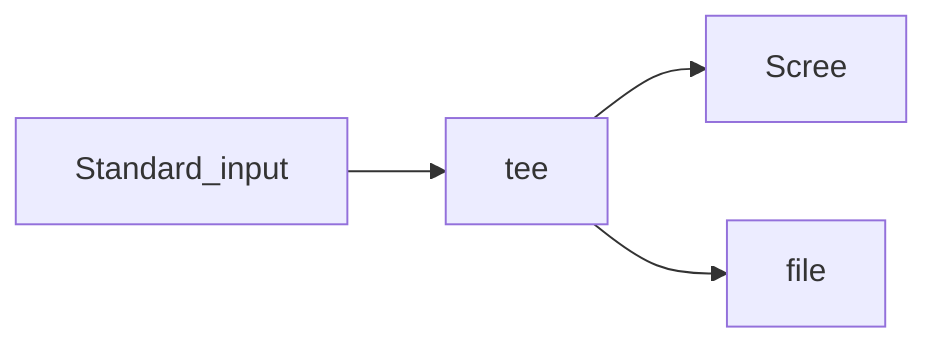

# 认识学习bash

##１．认识bash

###简介

只要能操作应用程序的接口都叫shell.

Linux使用的shell版本较多，查询方法如下：

```
$ cat /etc/shells 
# /etc/shells: valid login shells
/bin/sh
/bin/dash
/bin/bash                  <==Linux默认的shell
/bin/rbash
/usr/bin/tmux
/usr/bin/screen
```

系统默认的shell可以用下面的命令查看：

```
$ cat /etc/passwd
```

### bash shell的功能

bash的主要优点如下：

1. 命令记忆功能

   bash会记录下你以前执行的指令，默认可达到１０００个．

   这些命令记录在.bash_history文件中．需要注意的是，这个文件记载的时前一次登录所执行的命令，本次登录执行的命令会先存在于内存中，当成功注销后，该命令记忆才会记录到.bash_history中．

2. 命令与文件补全功能（[Tab]）

3. 命令别名设置功能(alias)

4. 作业控制，前台，后台控制

5. 程序脚本(shell script)

6. 通配符(Wildcard)

### bash shell的内置命令：type

bash内置了很多命令，如：cd, umarsk等

使用type命令可以查看命令的特征：

```
$ type ls
ls is aliased to `ls --color=auto'     <== 别名
$ type cd
cd is a shell builtin　　　　　　　　　　 <== shell内置

```

### 命令的执行

可用'\'转义'[Enter]'，实现命令换行

## ２．shell的变量功能

### 变量的显示与设置：echo, unset

1. 变量的显示：echo

   ```
   $ echo $variable    <== 语法
   $ echo $PATH
   或
   $ echo ${PATH}
   ```

2. 变量的设置：＝

   ```
   $ myname = zjj
   $ echo $zjj
   ```

   ​

3. 变量的设置规则：

   3.1 变量与变量内容以一个符号＂＝＂来连接，如下所示：

   ​	"myname=jj"

   3.2 等号两边不能直接接空格

   ​	"myname =jj"和"myname=j  j"都是错误的

   3.3 变量名称只能是英文字母和数字，且开头字符不能是数字

   3.4 变量内容如有空格可使用双引号或单引号将变量内容结合起来但是：

   	> **双引号内的特殊字符如$等，可以保持原有的特性**
   	>
   	> **单引号内的特殊字符只是一般的字符**

   3.5 可用转义字符'\'将特殊符号（如：[Enter], $, \, 空格, !等）转义成一般字符

   3.6　在一串命令中，可能需要通过其他的命令提供的信息，可以使用```"`命令`"```或"$(命令)"

   ​	如：```version=$(uname -r)``` 则可用```echo $version``` 命令的到"4.4.0-87-generic"

   ​	进入内核模块目录：```cd /lib/modules/`uname -r`/kernel```

   3.7 若该变量为了增加变量内容时，则可以用```"$变量名称"``` 或```${变量}``` 累加内容，如下所示：

   ​	```PATH="$PATH":/home/bin``` <==双引号，保持$原有的特性

     或：```PATH=$SPATH:/home/bin```

     或：```PATH=${SPATH}:/home/bin```

   3.8 若该变量需要在其他子进程执行，则需要以export来使变量变为环境变量：

   ​	"export PATH"

   3.９通常大写字符为系统默认字符，所有自行设置的变量尽量使用小写字符

   3.10 取消变量的方法为使用"unset 变量名",如："$ unset myname"

### 环境变量的功能

1. 查看环境变量的命令：env, export

```
＃ 用env列出目前shell环境下的所欲环境变量与其内容
$ env
LC_PAPER=zh_CN.UTF-8
XDG_SESSION_ID=467
...
```

环境变量及其含义:

|    变量    |                    含义                    |
| :------: | :--------------------------------------: |
|   HOME   |                代表用户的主文件夹                 |
|  SHELL   |          标明目前这个环境使用的shell程序是哪个           |
| HISTSIZE |                存储历史命令的条数值                |
|   MAIL   |                 用户邮箱文件位置                 |
|   PATH   | 执行文件查找的路径,目录与目录之间以(:)隔开,文件的查找顺序来,所以目录的顺序很总要 |
|   LANG   |   语系数据,中文通常是:zh_CN.gb2312和zh_CN.UTF-8    |
|  RANDOM  |   随机数生成器,echo $RANDOM时会给个0~32768之间的随机数   |

2. 用set查看所有变量(环境变量和自定义变量)

比较重要的几个变量为:

> 1. PS1(提示符的设置)
>
>    ```c
>    $ set | grep PS1
>    PS1='\[\e]0;\u@\h: \w\a\]${debian_chroot:+($debian_chroot)}\[\033[01;32m\]\u@\h\[\033[00m\]:\[\033[01;34m\]\w\[\033[00m\]\$ '
>
>    ```
>
>    PS1时我们的命令提示符,每次[Enter]时都会去读这个变量值,其主要参数如下:
>
>    |    参数    |                含义                 |
>    | :------: | :-------------------------------: |
>    |    \d    |      可以显示"星期月日",如"Mon Feb 2"      |
>    |    \H    |              完整的主机名               |
>    |    \h    |         仅取主机名第一个小数点之前的名字          |
>    |    \t    |      显示时间,为24小时格式的"HH:MM:SS"      |
>    |    \T    |      显示时间,为12小时格式的"HH:MM:SS"      |
>    |    \A    |       显示时间,为24小时格式的"HH:MM"        |
>    |    \@    |       显示时间,为12小时格式的"am/pm"        |
>    |    \u    |         目前用户的账号名称,如"root"         |
>    |    \v    |             BASH的版本信息             |
>    |    \w    |  完整的工作目录名称,由根目录泄气的目录名称,主文件夹会以~代替  |
>    |  \W(大写)  | 利用basename函数取得的工作目录名称,仅会列出最后一个目录名 |
>    | ```\#``` |             执行的第几个命令              |
>    | ```\$``` |        提示符,如果是root就为#,否则为$        |
>
>    如下命令：
>
>    ```
>    PS1='\e[;40m[\e[31;40m\u@fjcs \e[32;40m\w \e[33;40m\t \e[37;40m\#]\$ '
>    ```
>
>    ​
>
>    我们能够通过配置PS1变量使提示符成为彩色。在PS1中配置字符序列颜色的格式为：
>
>    ​   ``` \e[F;Bm\```   或　```\[\e[F;Bm\]```
>
>    ​    基本上是夹在 "\e["（转义开方括号）和 "m" 之间数字值。假如指定一个以上的数字代码，则用分号将他们分开。
>
>    ​    
>
>    ​    其中 F 为字体颜色，编号30~37； B 为背景色，编号40~47。
>
>
>    ​    可通过 \e[0m 关闭颜色输出；特别的，当B为1时，将显示加亮加粗的文字，请看下面的颜色表和代码表。
>
> ​    
>
>    ​    颜色表
>
> ​    
>
>    ​    前景 背景 颜色
>
>    ​    ---------------------------------------
>
> ​       30 40 黑色
>
> ​       31 41 红色
>
> ​       32 42 绿色
>
>    ​    33 43 黄色
>
>    ​    34 44 蓝色
>
> ​       35 45 紫色
>
>    ​    36 46 青色
>
>    ​    37 47 白色
>
> ​    
>
>    ​    代码 意义
>
>    ​    -------------------------
>
>    ​    0 OFF
>
>    ​    1 高亮显示
>
>    ​    4 underline
>
>    ​    5 闪烁
>
>    ​    7 反白显示
>
>    ​    8 不可见 
>
>    ​    ***假如想要配置终端提示符的样式只要把$PS1在~/.bahrc指定即可***
>
> 2. $ (本shell的ID)
>
>    shell的PID,用"echo $$"命令显示
>
> 3. ? (上个命令的回传码)
>
>    如果上个命令执行成功,则为0,执行错误则会返回错误码
>
> 4. OSTYPE, HOSTTYPE, MACHTYPE (主机硬盘与内核的等级)
>
> 5. export (自有变量转成环境变量)
>
>    子进程会继承父进程的环境变量,而不会继承自定义变量
>
>    ```
>    # 将自定义变量变为环境变量,使其可以被子进程bash使用
>    $ export 变量名
>    ```

### 影响显示结果的语系变量(locale)

查看本系统支持的语系:

```
$ locale -a
C
C.UTF-8
POSIX
en_US.utf8

```

我们可以通过修改如下环境变量来修订编码:

```
$ locale
LANG=en_US.UTF-8             <==主语言的环境
LANGUAGE=en_US:en          
LC_CTYPE="C"                 <==字符(文字)辨识的编码
LC_NUMERIC="C"               <==数字系统的显示数据
LC_TIME="C"                  <==时间系统的显示数据
LC_COLLATE="C"               <==字符串的比较与排序等
LC_MONETARY="C"              <==币值格式的显示等
LC_MESSAGES="C"              <==信息显示的内容,如菜单,错误信息等
LC_PAPER="C"
LC_NAME="C"
LC_ADDRESS="C"
LC_TELEPHONE="C"
LC_MEASUREMENT="C"
LC_IDENTIFICATION="C"
LC_ALL=C                     <==整体语系环境

```

**如果其他的语系变量都未被设置,则会被LANG或者是LC_ALL的语系变量代替**

### 变量的有效范围

### 变量键盘读取,数组与声明: read, array, declare

等待用户输入变量的值

1. read

   功能类似与c的scanf

   ```
   $ read [-pt] variable
   参数:
   -p: 后面可以接提示符
   -t: 后面可以接等待的"秒数"
   ```

   ```
   $ read atest

   # 提示用户输入信息,限三十秒
   $ read -p "Please input your name:   " -t 10 named
   Please input your name:   zjj
   $ echo $named
   zjj
   ```

   ​

2. declare/typeset

   这两个指令的功能都是**声明变量的类型**,如果使用declare后面并没有接任何参数,则功能和set一样

   declare的语法:

   ```
   $ declare [-aixr] variable
   参数:
   -a: 将后面名为variable 的变量定义为数组(array)类型
   -i: 将后面名为variable 的变量定义为整数(integer)类型
   -x: 用法与export相同,就是将后面的变量变成环境变量
   -r: 将变量修改为只读类型,该变量不可被更改内容,也不能重设
   ```

   ```
   # 让变量sum进行累加计算
   $ declare -i sum=1+2+3; echo $sum
   6
   # 将sum变为环境变量
   $ declare -x sum
   # 让sum变为非环境变量
   $ declare +x sum
   ```

   在默认情况下,bash 对变量有几个基本的规定:

   * 变量类型默认为"字符串",所以若不指定变量类型,1+2是个字符串而不是"计算式"
   * bash环境中的数值运算默认最毒能达到整数类型,所以1/3=0

3. 数组(array)变量类型

   ```
   $ var[1]=2
   $ var[2]=22
   $ var[3]=222
   $ echo "${var[1]}, ${var[2]}, ${var[3]}"
   2, 22, 222
   ```

   声明一个数组：
   declare -a array

   如果没有声明，按数组方式直接赋值给变量，BASH也认作数组：
   (1) array=(var1 var2 var3 ... varN)
   (2) array=([0]=var1 [1]=var2 [2]=var3 ... [n]=varN)
   (3) array[0]=var1
   ​    arrya[1]=var2
   ​    ...
   ​    array[n]=varN

   数组用法说明：
   ```${array[n]}```                     # 引用数组
   ```${array[*]} 或${array[@]} ```      # 数组所有成员
   ```${!array[*]} 或${!array[@]} ```    # 数组所有下标
   ```${#array[*]} 或${#array[@]}  ```   # 数组元素个数
   ```${#array[0]}  ```                 # 数组第一个成员的长度

   ```
   # COLOR=("red" "green" "yellow" "blue" [5]="orange")
   # echo ${#COLOR[*]}
   5
   # echo ${!COLOR[*]}
   0 1 2 3 5
   # for item in ${COLOR[*]}
   > do
   >     printf "   %s/n" $item
   > done
      red
      green
      yellow
      blue
      orange
   # for index in ${!COLOR[*]}
   > do
   >     printf "   %d/n" $index
   > done

      0
      1
      2
      3
      5

   注意数组下标可以有间断，上面的例子就缺少下标4，可以用单个数组元素赋值方法补上：
   # COLOR[4]="violet"
   # echo ${!COLOR[*]}
   0 1 2 3 4 5
   ```

   ​

   ### 与文件系统及程序的限制关系: ulimit

bash可以限制用户的某些资源,包括可以打开的文件数量,可以使用的cpu数,可以使用的内存总量等.用ulimit设置.

```
$ ulimit [-SHacdfltu] [配额]
参数:
-H: hard limit,严格的设置,必定不能超过设置的数值
-S: soft limit,警告的设置,可以超过这个值,但是会被警告
-a: 后面不接任何参数,可列出所有的限制配额
-c: 内核文件的最大容量(进程的错误信息)
-f: 此shell可创建的最大文件容量(一般肯能设置为2g),单位是KB
-d: 进程可以使用的最大segment内存容量
-l: 可用于锁的内存量
-t: 可使用的最大cpu时间,单位为秒
-u: 单一用户可以使用的最大进程数
```

### 变量内容的删除,替换和替换

1. 变量内容的删除与替换

   ***删除：***

   ```
   $ path=${PATH}
   $ echo $path
   /home/zjj/bin:/home/zjj/.local/bin:/usr/local/cuda/bin：/usr/local/sbin:/usr/local/bin:/usr/sbin:/usr/bin:/sbin:/bin:/usr/games:/usr/local/games:/snap/bin
   #如果不想要上述的zjj,可以将它删除
   $ echo ${path#/*zjj/bin:}
   /home/zjj/.local/bin:/usr/local/cuda/bin：/usr/local/sbin:/usr/local/bin:/usr/sbin:/usr/bin:/sbin:/bin:/usr/games:/usr/local/games:/snap/bin
   ＃会发现．．．/zjj/bin被删除了

   ＃参数解释：${vabriable#/*zjj/bin:}
   vabriable: 原本的变量名，如上面的path
   #: 这是重点，指从变量内容的最前面开始向右删除，且仅删除最短的那个　
   /*zjj/bin::只要删除的内容，*为通配符

   $ echo ${path#/*:}
   /home/zjj/.local/bin:/usr/local/cuda/bin：/usr/local/sbin:/usr/local/bin:/usr/sbin:/usr/bin:/sbin:/bin:/usr/games:/usr/local/games:/snap/bin <==删除了第一个，对端删除

   $ echo ${path##/*:}
   /snap/bin　　　　<==最长删除
   ```

   由于#是从前往后删，如果想从后往前删，将#换成%就可以了

   ```
   $ echo {path%:*bin}  /home/zjj/bin:/home/zjj/.local/bin:/usr/local/cuda/bin：/usr/local/sbin:/usr/local/bin:/usr/sbin:/usr/bin:/sbin:/bin:/usr/games:/usr/local/games
    
    $echo {path%%:*bin}
    /home/zjj/bin
   ```

   ***替换：***

   ```
   #将sbin替换成SBIN
   $ echo {path/sbin/SBIN}   /home/zjj/bin:/home/zjj/.local/bin:/usr/local/cuda/bin：/usr/local/SBIN:/usr/local/bin:/usr/sbin:/usr/bin:/sbin:/bin:/usr/games:/usr/local/games:/snap/bin
   #两个下划线之间是旧的字符，后面是新的字符，只会替换第一个

   $ echo {path//sbin/SBIN}  /home/zjj/bin:/home/zjj/.local/bin:/usr/local/cuda/bin：/usr/local/SBIN:/usr/local/bin:/usr/SBIN:/usr/bin:/SBIN:/bin:/usr/games:/usr/local/games:/snap/bin
   如果是两条下划线，则所有符合的情况都会替换

   ```

   **总结：**

   |      变量设置的方式       |                说明                 |
   | :----------------: | :-------------------------------: |
   |     ${变量#关键词}      | 若变量的内容从头开始的数据符合＂关键词＂，则将符合的最短数据删除  |
   |     ${变量##关键词}     | 若变量的内容从头开始的数据符合＂关键词＂，则将符合的最长数据删除  |
   |     ${变量%关键词}      | 若变量的内容从尾部向前的数据符合＂关键词＂，则将符合的最短数据删除 |
   |     ${变量%%关键词}     | 若变量的内容从尾部向前的数据符合＂关键词＂，则将符合的最长数据删除 |
   | ${变量/旧的字符串/新的字符串}  | 若变量的内容符合＂旧的字符串＂，则第一个旧字符串会被新的字符串替换 |
   | ${变量//旧的字符串/新的字符串} | 若变量的内容符合＂旧的字符串＂，则所有旧字符串都会被新的字符串替换 |


## ３．命令别名与历史命令

###命令别名设置nalias, unalias

查看目前所有的命名：

```
$ alias

alias alert='notify-send --urgency=low -i "([ ? = 0 ] && echo terminal || echo error)" "(history|tail -n1|sed -e '\''s/^\s[0-9]+\s//;s/[;&|]\s*alert//'\'')"'

alias egrep='egrep --color=auto'

alias fgrep='fgrep --color=auto'

alias grep='grep --color=auto'

alias l='ls -CF'

alias la='ls -A'

alias ll='ls -alF'

alias ls='ls --color=auto'

```

取消别名：

```$ unalias lm```

### 历史命令：history

bash有提供历史命令的服务，可以通过history命令查看：

```$ history```

取个别名：

```$ alias h='history'```

history命令，不只是为了查询命令，还有如下功能：

```
# !66   <==执行第６６条指令
# !!    <==执行上一条命令，本例中
# !al   <==执行最近以al开头的命令
```

## ４．Bash Shell的操作环境

### 命令和路径查找顺序

基本上，命令的查找顺序如下：

1. 以相对/绝对路径执行命令，例如"/bin/ls"或"./ls"
2. 由alias找到该命令来执行
3. 由bash内置的(bulitin)命令来执行
4. 通过$PATH这个变量的顺序找到的第一个命令来执行

### bash的登录与欢迎页面：/etc/issue, /et/motd

登录界面的字符串存在/etc/issue中：

```
$ cat /etc/issue
Ubuntu 16.04.2 LTS \n \l
```

issue中个参数的含义：

|  参数  |         含义          |
| :--: | :-----------------: |
|  \d  |        本地端时间        |
|  \l  |     显示几个终端机的接口      |
|  \m  |    显示硬件的等级(cpu)     |
|  \n  |      显示主机的网络名称      |
|  \o  |    显示domain name    |
|  \r  | 操作系统的版本，相当于uname -r |
|  \t  |     显示本地端时间的时间      |
|  \s  |       操作系统的名称       |
|  \v  |       操作系统的版本       |

可以通过修改/etc/issue文件来改变登录界面

当你用telnet连接到主机时，登录界面显示的时/etc/issue.net设置的内容，而不是/etc/issue的

***如果你想让用户登陆后取得一些信息，可以将信息加入到/etc/motd里面(没有文件可以自行创建)***：

```
$ vim /etc/motd
```

### bash的环境配置文件

***需要注意，前面的alias和自定义的变量在注销bash后就会消失，要想保住操作，可以将设置写入配置文件：***

1. login 与non-login shell
   * login shell: 取得bash时需要完整的登录流程，就称为login shell.
2. non-login shell: 已经登陆过就不用再次登录，如x windows的terminal

上述两种情况下，读取的配置文件数据并不一致：

login shell其实只会读取这两个配置文件

1. /etc/profile:　这是系统整体的设置，最好不要修改这个文件
2. ~/.bash_profile或~/.bash_login或~/.profile: 属于个人设置，要修改的数据就写在这里

* /etc/profile（login shell才会去读）

  这个配置文件可以利用用户的标识符（UID）来决定很多重要的变量数据，这也是**每个用户登录取得bash时一定会读取的配置文件．**所以如果想修改所有用户的整体环境，那就在这修改，其主要变量如下

  > PATH: 会依据UID决定PATH变量要不要含有sbin的系统命令目录
  >
  > MAIL: 依据账号设置好用户的maxbox到/var/spool/mail/账号吗
  >
  > USER: 根据用户账号设置此内容
  >
  > HOSTNAME: 依据主机的hostname绝对此值
  >
  > HISTSIZE: 历史命令记录条数

* ~/.bash_profile(login shell 才会读)

  bash在读完整体环境设置/etc/profile后，接下来回去读取用户的个人配置文件，在login shell的环境中，所读取的个人偏好设置主要有三个：

  > ~/.bash_profile
  >
  > ~/.bash_login
  >
  > ~/.profile

  按照上面的顺序，只会读取一个

* bash shell的流程如下：

  

  ​

实现为主线流程，虚线的方向这是被调用的配置文件

* source：　读入环境配置文件的命令

  通常修改配置文件时要注销再登录后才会其作用，但是source或小数点(.)命令可以读入配置文件，避免注销操作：

  ```
  $ source 配置文件
  # 下面两个命令相同
  $ source ~/.bashrc
  $ . ~/.bashrc
  ```

  ​

* ~/.bashrc (non-login shell读取)

  在non-login shell情况下，只会读取~/.bashrc配置文件．

* 其他配置文件

/etc/man.conf (或/etc/manpath.conf): 这个我文件规定了使用man 的时候man page的路径到哪里去寻找

~/.bash_history: 存放历史命令

~/.bash_logout: 注销时需要完成的操作

### 终端机的环境设置：　stty,set

stty (setting tty)命令可以用来帮助设置终端机的输入按键代表的含义

```
$ stty [-a]
-a: 将目前所有的tty列出来

$ stty -a
speed 38400 baud; rows 24; columns 80; line = 0;
intr = ^C; quit = ^\; erase = ^?; kill = ^U; eof = ^D; eol = <undef>;
eol2 = <undef>; swtch = <undef>; start = ^Q; stop = ^S; susp = ^Z; rprnt = ^R;
werase = ^W; lnext = ^V; discard = ^O; min = 1; time = 0;
-parenb -parodd -cmspar cs8 -hupcl -cstopb cread -clocal -crtscts
-ignbrk -brkint -ignpar -parmrk -inpck -istrip -inlcr -igncr icrnl ixon -ixoff
-iuclc -ixany -imaxbel iutf8
opost -olcuc -ocrnl onlcr -onocr -onlret -ofill -ofdel nl0 cr0 tab0 bs0 vt0 ff0
isig icanon iexten echo echoe echok -echonl -noflsh -xcase -tostop -echoprt
echoctl echoke -flusho -extproc

# ＇^＇表示[ctrl]键

$ stty erase ^h           <==设置

```

几个重要的设置含义：

> eof: End of file，结束输入
>
> erase: 向后删除一个字符
>
> intr: 送出一个interrupt(终端)信号给目前正在运行的程序
>
> kill:删除目前命令行上所有的文字
>
> quit: 送出一个quit命令
>
> start: 重新启动一个停止的进程
>
> stop: 通知目前的屏幕操作
>
> susp: 送出个terminal stop 的信号给正在运行的进程

处理tty之外，bash还有set命令，可以帮助我们设置整个命令的输出环境，如记录历史命令，显示错误内容等

### 通配符与特殊字符

常用的通配符：

|  符号  |                意义                |
| :--: | :------------------------------: |
|  *   |            代表０到无穷个字符             |
|  ?   |           代表一定有一个任意字符            |
|  []  | 代表一定有括号内的任意字符，如[a,b,c,d]，代表一定有一个 |
| [-]  | 代表编码顺序内的任意字符，如[0-9]则是0-9之间的所有字符  |
| [^]  |             不包括后述的字符             |

### 数据流重定向

标准输入，输出，错误的特殊字符如下：

1.  标准输入(stdin): 代码为0,使用<或<<
2.  标准输出(stdout)：代码为１，使用>或>>
3.  标准错误输出(stderr)：代码为２，使用2>或2>>

'>': 覆盖的方式输出，'>>':　累加的方式输出

* /shell/null垃圾桶黑洞设备

  可以帮助忽略错误信息：

  ```
  $ find /home -name .bashrc 2> /dev/null
  ```

  ​

* 将输出和错误写入同一个文件

  ```
  # 下述指令时错误的，同时写入同一文件，又没有特殊语法，数据会交叉写入
  $ find /home -name .bashrc > list 2> list
  # 下面两种方法皆可以
  $ find /home -name .bashrc > list 2>&1
  $ find /home -name .bashrc &> list
  ```


### 命令执行的判断依据：　;  , && , ||

一次性输入多个命令：使用shell script编写脚本，或者使用下述方法：

1. cmd; cmd (不考虑命令相关性的连续命令执行)

   如，在关机时，我们希望可以先执行两次sync同步写入磁盘后再shotdown计算机，可以这么做：

   ```
   $ sync; sync; shutdown -h now
   ```

2. $?(命令回传码)与&&或||

   每条命令执行过后都会修改"$?"的值，当后一条命令需要判断前一条命令的回传码时，就得使用"&&"与"||"了

   |       指令       |                    说明                    |
   | :------------: | :--------------------------------------: |
   |  cmd1 && cmd2  | ```若cmd1执行完毕且正确执行($?=0)，则开始执行cmd2, 若cmd1执行完毕且报错($?不等于0)，则cmd2不执行``` |
   | cmd1 \|\| cmd2 | ```若cmd1执行完毕且正确执行($?=0)，则不执行cmd2, 若cmd1执行完毕且报错($?不等于0)，则cmd2开始执行``` |


3. 管道命令

后一条命令用到前一条命令的结果，如下：

```
$ ls -al /etc | less
```

管道只接受前一条命令传来的正确信息，也就是standard output,对于standard error会忽略

### 选取命令：cut, grep

选取命令一般是对"行"来分析的，并不是整篇信息分析

1.  cut

   ```
   $ cut -d '分隔符'　-f fields   <==　用于分隔字符
   $ cut -c 字符范围　　　　　　　　 <== 用于排列整齐的信息
   参数：
   -d: 后街分隔字符，与-f一起用
   -f: 依据-d的分隔字符将一段信息切割成数段，用-f取出第几段的意思
   -c:　以字符的单位取出固定字符区间
   ```

   范例：

   ```
   # 将PATH变量的第３，５个路径取出：
   $ echo $PATH | cut -d ':' -f 3,5

   # 取出export输出信息第１２个字符后的所有字符串：
   $ export | cut -c 12-
   HOME="/home/zjj"      <==　每一行，１２个字符以后的数据，包括第１２个字符
   LANG="en_US.UTF-8"
   LANGUAGE="en_US:en"
   LC_ADDRESS="zh_CN.UTF-8"
   LC_ALL="C"
   ...
   # 我们还可以指定范围，如第12-20的字符，cut -c 12-20
   ```

   ​

2. grep

   分析一行信息，当信息中有我们所需要的数据时，就将该行拿出来.用在正则表达式里面，grep的功能很强大

### 排序命令： sort, wc, uniq

使用last命令可以查看这个月有哪些用户登录主机，但是如何统计他们登录的总次数？下面有些统计命令

1. sort

   sort可以依据不同的类型对数据进行排序．注意：由于排序的字符与语系的编码有关，所以需要排序时，建议使用LANG=C让语系统一

   ```
   # 将last的输出数据只取出账号信息，并加以排序
   $ last | cut -d ' ' -f 1 | sort
   # /etc/passwd是以:来分隔的，我们想以第三列来排序：
   $ cat /etc/passwd | sort -t ':' -k 3 -n
   # -t表示分隔符是什么，默认为[Tab]，-k指分隔符分成的区域选那块,-n表示用纯数字来排序，默认为文本格式
   ```

   ​

2. uniq

   排序完成后，重复的数据只显示一行：

   ```
   $ uniq [-ic]
   参数：
   -i: 忽略大小写参数的不同
   -c: 进行计数

   # 对于last的输出结果，仅取出账号列，进行排序后输出（相同的输出一次，并进行计数）
   $ last | cut -d ' ' -f 1 | sort -n | uniq -c 
         1 
         3 fwq
        15 keith
         1 liu
         6 reboot
         1 wtmp
        88 zjj
   ```

   ​

3. wc

   统计文件的行数，字符数等

   ```
   $ wc [-lwm]
   参数：
   -l: 仅列出行
   -w: 仅列出多少字（英文单词）
   -m: 多少字符

   $ last | wc -l
   $ wc  Aux_DB.py 
     285   681 11867 Aux_DB.py
   ```

### 双向从定向: tee

```>```可以讲数据流重定向到文件或设备，但是，当我想将数据流处理过程中的某段信息存下来，可以使用tee命令

其流程图如下：


tee可以将数据流送与文件和显示屏，而送至显示屏的就是stdout,可以被进一步使用

```
$ tee [-a] file
参数：
-a: 以累加的方式，将数据加入file文件

$ ll / | tee -a ~/homefile | less
```

### 字符转换命令：　tr, col, join, paste, expand

1. tr

   tr可以用来删除一段信息当中的文字或者进行文字信息的替换

   ```
   $ tr [-ds] SET1
   参数：
   -d: 删除信息当中的SET１这个字符串
   -s: 替换掉重复的字符

   #　将last输出信息中所有的小写字符换成大写字符
   $ last | tr '[a-z]' '[A-Z]'  <== 不加单引号也可以
   ```

   ​

2. col

   ```
   $ col [-xb]
   参数：
   -x: 将tab键转换成对等的空格
   -b:　在文字内有反斜杠（/）时，仅保留反斜杠后面接的字符
   ```

   col常用与man page转存为纯文本文件以方便查阅的功能

3. join

   其功能主要是将两个文件当中有相同数据的那一行加在一起

4. paste

   paste比join要简单，用法如下：

   ```
   $ paste [-d] file1 file2
   参数：
   -d：　后面可以接分个字符，默认是以[tab]分隔
   -: 如果file部分为-,表示来自stdin的数据
   ```

   ​

5. expand

   将[tab]按键换成空格

   ```
   $ expand [-t] file
   参数：
   -t:　后接数字，表示一个[tab]换成多少个空格 
   ```

   unexpand: 将空格换成[tab]

### 切割命令：split

可以将大文件依据大小或行数来切割成小文件

```
$ split [-bl] file PREFIX
参数：
-b: 后接欲切割成的文件的大小，可加单位：b, k, m等
-l: 以行数来进行分割
PREFIX: 可作为切个文件的前导符

#将/etc/termcap分成三个大小为３００kB的文件
$ cd /tmp; split -d 300k /etc/termcap termcap
#生成的三个文件名：termcapaa, termcapab, termcapac

#将上面三个文件合成一个名为termcapback的文件：
$ cat termcap* >> termcapback

#　将ls -al /的输出信息每１０行记录成一个文件
$ ls -al / | split -l 10 - lsroot     <==　注意-,表示stdin
```

### 参数带换: xargs

xargs可以读入stdin的数据，并按照空格或分隔符将数据分隔成arguments

```
$ xargs [-Oepn] command
参数：
-O：　将stdin的特殊字符还原成一般字符
-e: EOF，当xargs分析到此参数后面的字符串时会停止,-e和后接的字符串间没有空格
-p: 在执行每条命令时都会询问用户
-n: 后接次数，每次command命令执行时，要使用几个参数的意思
当xargs后面没有接参数时，默认以echo来进行输出
```

**很多命令不支持管道命令，我们可以通过使用xargs来提供该命令使用stdin只用**：

```
$ fin /sbin -perm +7000 | xargs ls -l
```

